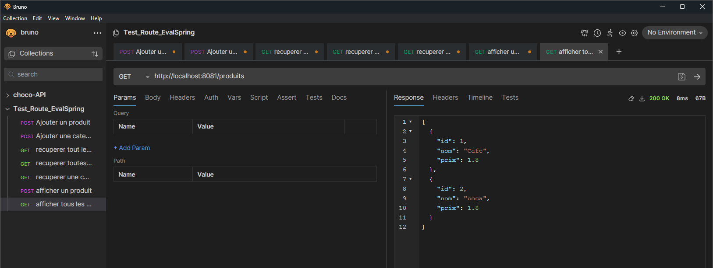
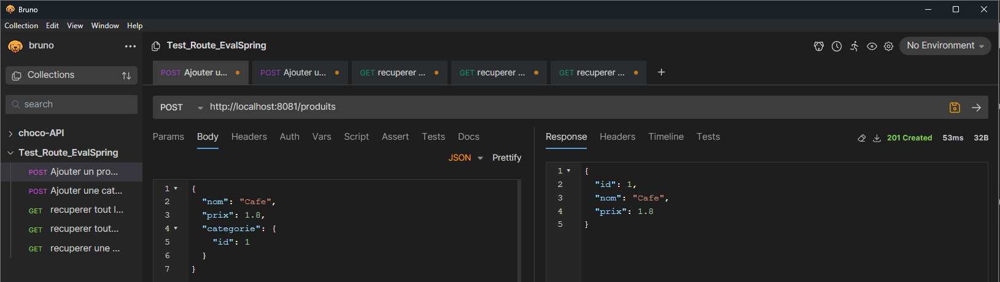
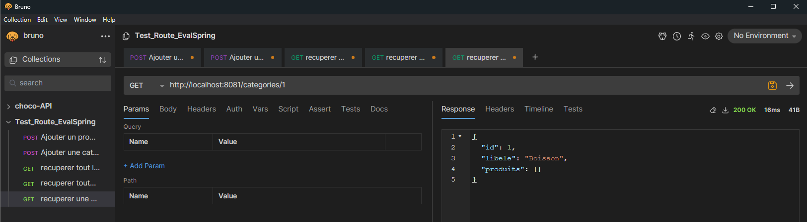

# **Evaluation Spring Boot**
## *Requetes HTTP*
Cette documentation a pour but de décrire toutes les requêtes HTTP disponibles dans l'API, avec le corps des requêtes et les résultats attendus.

# Produit
- Afficher tous les produits
-> méthode GET http://localhost:8081/produits

exemple de réponse reçue : 
json
[
  {
    "id": 1,
    "nom": "Café",
    "prix": 1.8,
  },
  {
    "id": 2,
    "nom": "Thé",
    "prix": 3.8,
  }
]

- Ajouter un produit :
-> méthode POST http://localhost:8081/produits

exemple de corps de requête : 
{
  "nom": "Café",
  "prix": 1.8,
  "categorie": {
    "id": 2
  }
}
réponse attendue :
{
  "id": 1,
  "nom": "Café",
  "prix": 1.8,
}

# Category
- Afficher une categorie par son ID
-> méthode GET http://localhost:8081/categories/{id}

exemple de réponse reçue :
{
    "id":1,
    "libele":"Boisson",
    "produits": []
}

